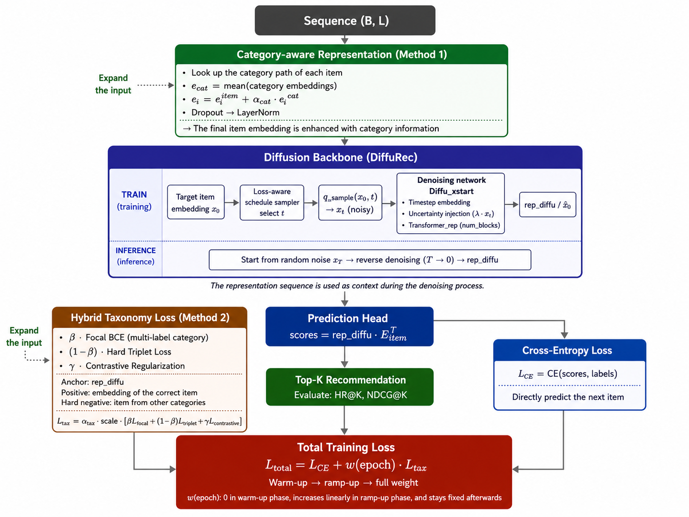

# Tax-DiffuRec: Taxonomy-Guided Diffusion for Sequential Recommendation

This repository provides a PyTorch implementation of **Tax-DiffuRec**, a taxonomy-guided extension of DiffuRec for sequential recommendation.

Tax-DiffuRec extends the original [DiffuRec](https://arxiv.org/abs/2304.00686) model by incorporating item category/taxonomy information through two main components:

* **Category-aware Representation**: enhances item embeddings with category embeddings.
* **Hybrid Taxonomy Loss**: guides the representation learning process using taxonomy-aware training signals, including Focal Category Loss, Hard Triplet Loss, and Contrastive Regularization.

This implementation is developed for the graduation thesis:

> Taxonomy-Guided Diffusion for Sequential Recommendation(Gợi ý tuần tự bằng mô hình khuếch tán có hướng dẫn theo phân cấp danh mục)

## Overview

Sequential Recommendation aims to predict the next item a user may interact with based on the user's historical interaction sequence. Recent diffusion-based recommendation models, such as DiffuRec, approach this problem by generating or reconstructing the target item representation through a denoising process.

However, the original DiffuRec mainly relies on item IDs and user behavior sequences, while the semantic relationships among items, such as category or taxonomy information, are not explicitly exploited.

Tax-DiffuRec addresses this limitation by integrating taxonomy information into the diffusion-based sequential recommendation framework. Specifically, the model enhances item representations using category embeddings and introduces a hybrid taxonomy-aware loss to organize the embedding space according to category-level semantic relationships.

The overall architecture is shown below:



## Model Components

### 1. Category-aware Representation

For each item, Tax-DiffuRec looks up its category path from `category_map`. The category embeddings are aggregated and combined with the original item embedding:

```text
item representation = item embedding + category-aware embedding
```

This allows each item to carry additional semantic information from its category hierarchy.

### 2. Hybrid Taxonomy Loss

The Hybrid Taxonomy Loss is designed to guide the learned representations using taxonomy information. It consists of three components:

* **Focal Category Loss**: encourages the generated representation to preserve category-level information.
* **Hard Triplet Loss**: pulls items from similar categories closer and pushes items from different categories farther apart.
* **Contrastive Regularization**: encourages the generated representation to stay close to the ground-truth item embedding.

The final training objective combines the recommendation loss and taxonomy loss:

```text
L_total = L_CE + w(epoch) * L_tax
```

A warm-up and ramp-up strategy is used to gradually introduce taxonomy loss during training.


## Requirements

The code is implemented in Python with PyTorch.

Main dependencies:

```text
python >= 3.8
torch
numpy
pandas
scipy
tqdm
scikit-learn
```

The experiments were conducted on Google Colab using an NVIDIA Tesla T4 GPU, Python, and PyTorch.

## Dataset

This repository uses preprocessed Amazon Review datasets:

* Amazon Beauty
* Amazon Toys and Games

The expected dataset structure is:

```text
datasets/data/
├── amazon_beauty/
│   └── dataset.pkl
└── toys/
    └── dataset.pkl
```

Each `dataset.pkl` file contains the processed training, validation and test data, together with item/category mappings required by Tax-DiffuRec.

Due to file size and dataset license restrictions, raw Amazon review data is not included in this repository. Please preprocess the raw Amazon Review Dataset and place the processed `dataset.pkl` files in the corresponding folders.

## Usage

### Train and evaluate on Amazon Beauty

```bash
python src/main.py \
  --dataset amazon_beauty \
  --device cuda \
  --cat_alpha 0.05 \
  --alpha_taxonomy 0.5 \
  --loss_scale 17.0 \
  --warmup_epochs 25 \
  --rampup_epochs 25
```

### Train and evaluate on Amazon Toys and Games

```bash
python src/main.py \
  --dataset toys \
  --device cuda \
  --cat_alpha 0.05 \
  --alpha_taxonomy 0.5 \
  --loss_scale 17.0 \
  --warmup_epochs 25 \
  --rampup_epochs 25
```


## Results

The model is evaluated using full ranking on all items with the following metrics:

* HR@5, HR@10, HR@20
* NDCG@5, NDCG@10, NDCG@20

Summary results are provided in the `results/` directory.

## Acknowledgements

This project is built upon the original DiffuRec implementation:

> Zihao Li, Aixin Sun, and Chenliang Li.
> DiffuRec: A Diffusion Model for Sequential Recommendation.
> ACM Transactions on Information Systems, 42(3), Article 66, 2024.
> https://doi.org/10.1145/3631116

We thank the authors of DiffuRec for releasing their code.

## Citation

If you use this repository, please cite the original DiffuRec paper:

```bibtex
@article{10.1145/3631116,
  author = {Li, Zihao and Sun, Aixin and Li, Chenliang},
  title = {DiffuRec: A Diffusion Model for Sequential Recommendation},
  year = {2023},
  issue_date = {May 2024},
  publisher = {Association for Computing Machinery},
  address = {New York, NY, USA},
  volume = {42},
  number = {3},
  issn = {1046-8188},
  doi = {10.1145/3631116},
  journal = {ACM Transactions on Information Systems}
}
```

For this thesis implementation, please cite:

```text
Do Cao Huy. Tax-DiffuRec: Taxonomy-Guided Diffusion for Sequential Recommendation. Graduation Thesis, Hung Yen University of Technology and Education, 2026.
```
